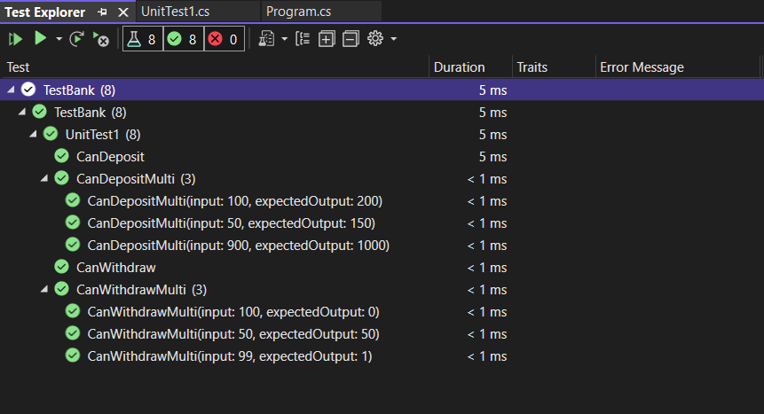

# Unit-Test

### Summary:
An ATM application that views balance, Depoists & withdraws.

### How to use:
1. Open the solution file (.sln)  
2. Run the Program.cs File & Follow instructions on the command line.

### Extra:

You can test if the functions are working or not by right clicking anywhere inside the UnitTest1 script and choosing Run Test!

### Test Results:

